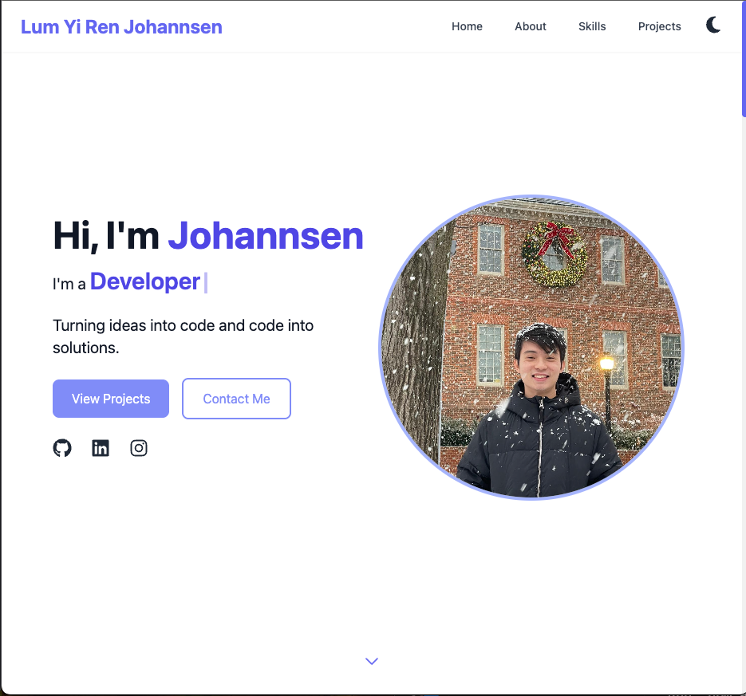
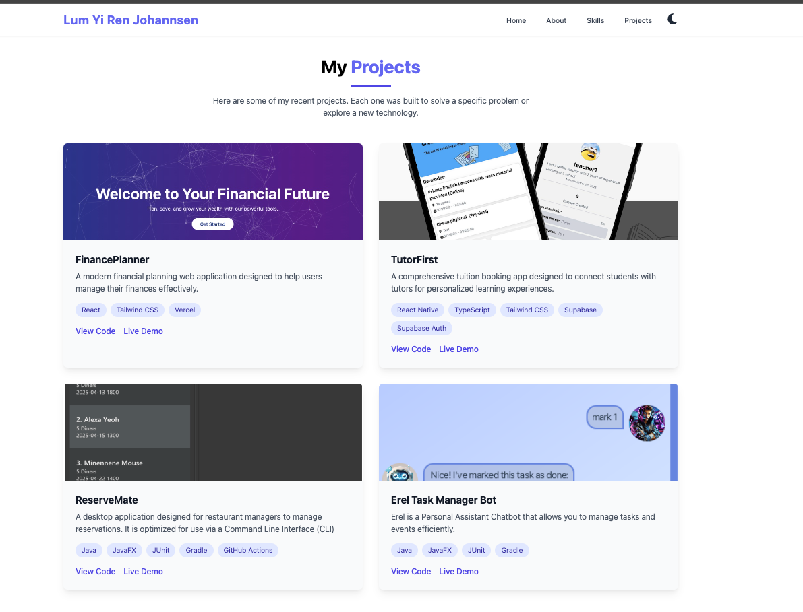

# 🌐 My Portfolio Website

A modern, responsive portfolio website built with [React + Tailwind CSS] to showcase my projects, skills, and experience.

## 🚀 Live Demo

🔗 [View Website](https://my-portfolio-gilt-ten-31.vercel.app/)

## 🛠️ Tech Stack

- **Frontend:** React, Tailwind CSS
- **Deployment:** Vercel

## 📸 Screenshots




## 📁 Features

- Responsive design for mobile and desktop
- Dark mode support
- Project showcase with links to live demos and GitHub
- About me & contact section

## 🚧 Installation & Setup

If you'd like to run this locally:

```bash
git clone https://github.com/JohannsenLum/my-portfolio.git
cd my-portfolio
npm install
npm run start
```
